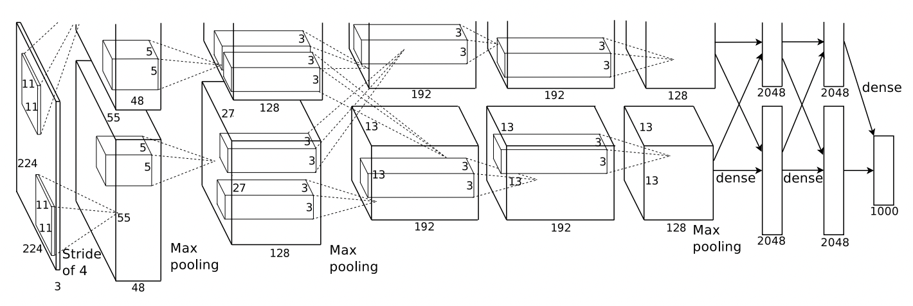

# AlexNet

## 目录


- [1. 简介]()
- [2. 数据集和复现精度]()
- [3. 准备数据与环境]()
    - [3.1 准备数据]()
    - [3.2 准备环境]()
    - [3.3 准备模型]()
- [4. 开始使用]()
    - [4.1 模型训练]()
    - [4.2 模型评估]()
    - [4.3 模型预测]()
- [5. 模型推理部署]()
    - [5.1 基于Inference的推理]()
    - [5.2 基于Serving的服务化部署]()
- [6. 自动化测试脚本]()
- [7. 参考链接与文献]()


## 1. 简介

AlexNet是2012年ImageNet竞赛冠军获得者Hinton和他的学生Alex Krizhevsky设计的。主要创新点如下。

* 首次引入ReLU激活函数：之前都是tanh和sigmoid激活函数，收敛慢且效果不好，用ReLU可以保证很多权重梯度不消失，且计算量更少，效果更好
* 首次使用多个GPU并行训练：由于当时的GPU设备显存较小，AlexNet使用了两个GPU并行计算
* 使用overlapping pooling：滑动窗口大于滑动步长，可以避免过拟合，进一步提升精度
* 使用Dropout：该技术可以减少神经元之间的相互依赖性。因此，模型被强制学习更加稳健的特征


<div align="center">
    
</div>

**论文:** [ImageNet Classification with Deep Convolutional Neural Networks](https://proceedings.neurips.cc/paper/2012/file/c399862d3b9d6b76c8436e924a68c45b-Paper.pdf)

**参考repo:** [https://github.com/pytorch/vision](https://github.com/pytorch/vision)

**aistudio体验教程:** coming soon!

## 2. 数据集和复现精度

数据集为ImageNet，训练集包含1281167张图像，验证集包含50000张图像。


| 模型      | top1/5 acc (参考精度) | top1/5 acc (复现精度) | 下载链接 |
|:---------:|:------:|:----------:|:----------:|
| AlexNet | 0.565/0.791   | 0.790/0.564   | [模型](https://paddle-model-ecology.bj.bcebos.com/model/alexnet_reprod/alexnet_pretrained.pdparams) \| [日志](https://paddle-model-ecology.bj.bcebos.com/model/alexnet_reprod/alexnet_train.log) |


## 3. 准备环境与数据

### 3.1 准备环境

* 下载代码

```bash
git clone https://github.com/littletomatodonkey/AlexNet-Prod.git
cd AlexNet-Prod/pipeline/Step5/AlexNet_paddle
```

* 安装paddlepaddle

```bash
# 需要安装2.1以上版本的Paddle，如果
# 安装GPU版本的Paddle
pip install paddlepaddle-gpu==2.2.0
# 安装CPU版本的Paddle
pip install paddlepaddle==2.2.0
```

更多安装方法可以参考：[Paddle安装指南](https://www.paddlepaddle.org.cn/)。

* 安装requirements

```bash
pip install -r requirements.txt
```

### 3.2 准备数据

如果您已经ImageNet1k数据集，那么该步骤可以跳过，如果您没有，则可以从[ImageNet官网](https://image-net.org/download.php)申请下载。

如果只是希望快速体验模型训练功能，则可以直接解压`test_images/lite_data.tar`，其中包含16张训练图像以及16张验证图像。

```bash
tar -xf test_images/lite_data.tar
```

### 3.3 准备模型

如果您希望直接体验评估或者预测推理过程，可以直接根据第2章的内容下载提供的预训练模型，直接体验模型评估、预测、推理部署等内容。


## 4. 开始使用

### 4.1 模型训练

* 单机单卡训练

```bash
export CUDA_VISIBLE_DEVICES=0
python3.7 train.py --data-path=./ILSVRC2012 --lr=0.00125 --batch-size=32
```

部分训练日志如下所示。

```
[Epoch 1, iter: 4780] top1: 0.10312, top5: 0.27344, lr: 0.01000, loss: 5.34719, avg_reader_cost: 0.03644 sec, avg_batch_cost: 0.05536 sec, avg_samples: 64.0, avg_ips: 1156.08863 images/sec.
[Epoch 1, iter: 4790] top1: 0.08750, top5: 0.24531, lr: 0.01000, loss: 5.28853, avg_reader_cost: 0.05164 sec, avg_batch_cost: 0.06852 sec, avg_samples: 64.0, avg_ips: 934.08427 images/sec.
```

* 单机多卡训练

```bash
export CUDA_VISIBLE_DEVICES=0,1,2,3
python3.7 -m paddle.distributed.launch --gpus="0,1,2,3" train.py --data-path="./ILSVRC2012" --lr=0.01 --batch-size=64
```

更多配置参数可以参考[train.py](./train.py)的`get_args_parser`函数。

### 4.2 模型评估

该项目中，训练与评估脚本相同，指定`--test-only`参数即可完成预测过程。

```bash
python train.py --test-only --data-path=/paddle/data/ILSVRC2012 --pretrained=./alexnet_paddle.pdparams
```

期望输出如下。

```
Test:  [   0/1563]  eta: 1:14:20  loss: 1.0456 (1.0456)  acc1: 0.7812 (0.7812)  acc5: 0.9062 (0.9062)  time: 2.8539  data: 2.8262
...
Test:  [1500/1563]  eta: 0:00:05  loss: 1.2878 (1.9196)  acc1: 0.7344 (0.5639)  acc5: 0.8750 (0.7893)  time: 0.0623  data: 0.0534
Test: Total time: 0:02:05
 * Acc@1 0.565 Acc@5 0.791
```

### 4.3 模型预测

* 使用GPU预测

```
python tools/predict.py --pretrained=./alexnet_paddle.pdparams --model=alexnet --img-path=images/demo.jpg
```

对于下面的图像进行预测

<div align="center">
    
</div>

最终输出结果为`class_id: 8, prob: 0.9990353584`，表示预测的类别ID是`8`，置信度为`0.999`。

* 使用CPU预测

```
python tools/predict.py --pretrained=./alexnet_paddle.pdparams --model=alexnet --img-path=images/demo.jpg --device=cpu
```


## 5. 模型推理部署

### 5.1 基于Inference的推理

#### 5.1.1 模型动转静导出

使用下面的命令完成`AlexNet`模型的动转静导出。

```bash
python tools/export_model.py --pretrained=./alexnet_paddle.pdparams --save-inference-dir="./alexnet_infer" --model=alexnet
```

最终在`alexnet_infer/`文件夹下会生成下面的3个文件。

```
alexnet_infer
     |----inference.pdiparams     : 模型参数文件
     |----inference.pdmodel       : 模型结构文件
     |----inference.pdiparams.info: 模型参数信息文件
```

#### 5.1.2 模型推理


```bash
python deploy/py_inference/infer.py --model-dir=./alexnet_infer/ --img-path=./images/demo.jpg
```

对于下面的图像进行预测

<div align="center">
    
</div>

在终端中输出结果如下。

```
image_name: ./images/demo.jpg, class_id: 8, prob: 0.9990355968475342
```

表示预测的类别ID是`8`，置信度为`0.999`，该结果与基于训练引擎的结果完全一致。


### 5.2 基于Serving的服务化部署

Serving部署教程可参考：[链接](deploy/py_serving/README.md)。


## 6. 自动化测试脚本

测试流程如下。

* 准备数据

```bash
# 解压数据，如果您已经解压过，则无需再次运行该步骤
tar -xf lite_data.tar
```

* 运行测试命令

```bash
bash test_tipc/test_train_inference_python.sh test_tipc/configs/AlexNet/train_infer_python.txt lite_train_lite_infer
```

如果运行成功，在终端中会显示下面的内容，具体的日志也会输出到`test_tipc/output/`文件夹中的文件中。

```
Run successfully with command - python3.7 -m paddle.distributed.launch --gpus=0,1 train.py --lr=0.001 --data-path=./lite_data --device=cpu --output-dir=./test_tipc/output/norm_train_gpus_0,1_autocast_null --epochs=1     --batch-size=1    !  
 ...
Run successfully with command - python3.7 deploy/py_inference/infer.py --use-gpu=False --use-mkldnn=False --cpu-threads=6 --model-dir=./test_tipc/output/norm_train_gpus_0_autocast_null/ --batch-size=1     --benchmark=False     > ./test_tipc/output/python_infer_cpu_usemkldnn_False_threads_6_precision_null_batchsize_1.log 2>&1 !  
```


* 更多详细内容，请参考：[Linux GPU/CPU 基础训练推理测试文档](./test_tipc/README.md)。
* 如果运行失败，可以先根据报错的具体命令，自查下配置文件是否正确，如果无法解决，可以给Paddle提ISSUE：[https://github.com/PaddlePaddle/Paddle/issues/new/choose](https://github.com/PaddlePaddle/Paddle/issues/new/choose)；如果您在微信群里的话，也可以在群里及时提问。


## 7. 参考链接与文献

1. Krizhevsky A, Sutskever I, Hinton G E. Imagenet classification with deep convolutional neural networks[J]. Advances in neural information processing systems, 2012, 25: 1097-1105.
2. vision: https://github.com/pytorch/vision
